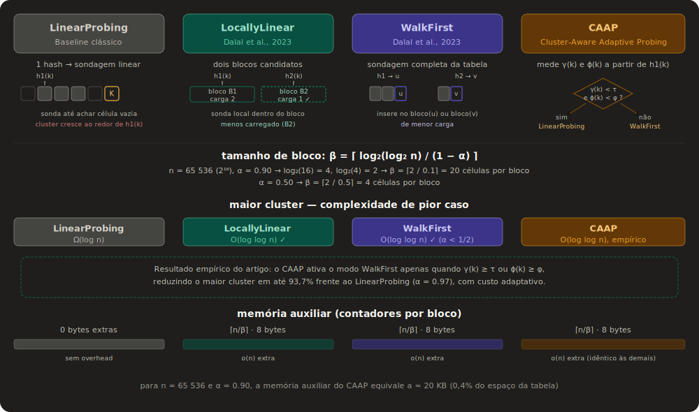

<p id="title" align="center">
  <a href="#title">
    <h1 align="center">Adaptive Hash Probing Study</h1>
  </a>
</p>

<p align="center">
  <a aria-label="Made By Aristofany" href="https://github.com/aristofany-herderson/">
    
  </a>
  <a aria-label="Enjoy My Repos" href="https://github.com/aristofany-herderson?tab=repositories">
    
  </a>
</p>

<p align="center">💥 Um estudo comparativo de estratégias avançadas de endereçamento aberto para tabelas Hash</p>

<br>

## 🧪&nbsp; Tecnologias

Este projeto foi desenvolvido com as seguintes tecnologias e ferramentas:

- **C++** - Código performático estruturado em orientação a objetos clássica utilizando polimorfismo dinâmico.
- **CMake** - Sistema de build e automação de compilação.

<br>

## 🧑🏻‍💻&nbsp; Como Começar

Clone o projeto e acesse a pasta do repositório:

```bash
$ git clone https://github.com/aristofany-herderson/adaptive-hash-probing 

$ cd adaptive-hash-probing
```

Para compilar e executar a suíte de benchmarks, siga os passos abaixo:
```bash
# Configurar e compilar o projeto com CMake
$ g++ -std=c++14 -O2 -Wall -Wextra -Iinclude src/benchmark.cpp -o build/benchmark.exe

# Executar a aplicação de benchmark
$ ./build/benchmark

# teste rápido
$ ./build/benchmark --quick
```

Para gerar os gráficos plotados:

```bash
# gera PNGs em results/plots/
$ python scripts/plot_results.py
```

### Argumentos de Linha de Comando Suportados:

| Flag | Default | Description |
|---|---|---|
| `--table-size N`  | `65536` | Define o tamanho base da tabela hash.  
| `--repetitions`   | `50` | Quantidade de iterações por cenário de teste para mitigação de ruídos.
| `--seed`          | `42` | Altera a semente inicial do motor PRNG.  
| `--output`        | `results` | Diretório para salvamento do relatório estatístico bruto.  
| `--quick`         | autoimplementado | Modo rápido (Reduz tamanho para 8192 e repetições para 5).  

<br />

# 💻  O Projeto

**Resumo:** Análise experimental empírica de algoritmos de resolução de colisão baseados em Two-Way Probing combinado com blocos estruturais (Dalal et al., 2023) contra o tradicional Linear Probing.

<br />

# 📐 Arquitetura das Estratégias Analisadas
Abaixo está o diagrama macro estrutural de funcionamento:



De forma mais explicada:

`LinearProbingTable` — baseline

Quando inserimos uma chave k, calculamos idx = hash1(k) % capacity e percorremos linearmente até encontrar uma célula vazia. A chave entra ali. A busca faz o mesmo percurso: parte de hash1(k) e anda para a direita; se bate numa célula vazia, a chave não existe.

O problema clássico é o primary clustering: colisões em torno do mesmo idx formam um aglomerado contínuo, e qualquer nova chave que caia nessa vizinhança prolonga o aglomerado. 

O paper prova que o maior cluster cresce como Ω(log n) com probabilidade alta.

`LocallyLinearTable` — LOCALLYLINEAR do paper

A tabela é particionada em blocos de tamanho β. Cada bloco mantém um contador de quantas chaves ele contém (block_loads_).

Na inserção, duas células iniciais são sorteadas (h1 e h2) e identifica-se a qual bloco cada uma pertence. O algoritmo escolhe o bloco menos carregado dos dois. A partir da célula inicial daquele bloco, sonda linearmente dentro do bloco - ciclicamente se necessário. Se o bloco estiver lotado, avança para o bloco vizinho à direita.

A busca percorre os dois blocos iniciais (de h1 e h2) e, se ambos estiverem cheios e a chave não foi encontrada, avança pelos blocos vizinhos. 

O resultado teórico: pior caso O(log log n) para busca malsucedida (Teorema 8 do paper), com tamanho de bloco β₁ = ⌈(log₂ log₂ n + C)/(1 − α)⌉.

`WalkFirstTable` — WALKFIRST do paper

A diferença para LocallyLinear é onde a sondagem linear acontece: não dentro do bloco, mas ao longo da tabela inteira. Dadas as células iniciais h1 e h2, o algoritmo anda linearmente a partir de cada uma até encontrar duas células terminais u e v, as primeiras células vazias que cada percurso encontra. Então insere no terminal cujo bloco tiver menor carga entre bloco(u) e bloco(v).

A busca deve percorrer ambas as cadeias alternadamente. 

O resultado teórico é O(log log n) para α < 1/2 (Teorema 10), e as simulações do paper sugerem que isso vale para qualquer α constante.

`AdaptiveLocalTable` — heurística própria

Antes de inserir, mede dois indicadores locais a partir de h1(k): o tamanho do cluster à frente (measure_forward_cluster) e a taxa de ocupação do bloco correspondente.

Se o cluster for pequeno (< cluster_threshold, padrão 8) e o bloco estiver abaixo de 85% de ocupação, usa inserção Linear clássica — simples e barata. Caso contrário, ativa o modo WalkFirst. A lógica é: em regiões pouco congestionadas, o custo extra de calcular h2 e explorar dois terminais não compensa; só quando há saturação local é que o redirecionamento ajuda.

## Justificativa dos valores padrões
`cluster_threshold = 8` - valor heurístico. Em α = 0.5, o cluster esperado é 1/(1−α)² ≈ 4. Um limiar de 8 ativa o modo two-way quando o cluster já está ~2× acima do esperado, antes de causar degradação severa. Obs.: o paper não prescreve esse valor, precisa ser ajustado empiricamente pelos gráficos.

`block_fill < 0.85` - também heurístico. Garante que o linear probing local ainda tem ~15% de células livres no bloco, tornando a sondagem interna barata antes de escalar para two-way.

`kEmptyKey = UINT64_MAX` - as chaves geradas no benchmark são 1..key_count, então UINT64_MAX nunca é uma chave válida. Sentinel em vez de campo de estado separado economiza memória e mantém cache-friendliness.

`Seeds 0xC0FFEEULL, 0xFACEFEEDULL, 0xBADB001ULL` - seeds diferentes para cada estratégia evitam correlação entre as decisões de desempate nas três tabelas numa mesma rodada do benchmark.

`repetitions = 50` - cada cenário (α × estratégia) roda 1000 vezes com chaves diferentes. Suficiente para estabilizar médias e identificar pior caso; o paper original usou 1000 iterações de 100 simulações, mas para fins didáticos 1000 repetições produz gráficos legíveis.

<br />

# 🚀 Features Cobertas pela Amostragem
- [x] Geração automática de chaves permutadas unicamente por meio de funções.  
- [x] Coleta em tempo real de métricas avançadas: tamanho máximo do maior cluster contíguo, sondagens médias de inserção e buscas falhas/com sucesso.  
- [x] Exportação dos dados brutos estruturados diretamente para planilhas em formato .csv para posterior plotagem gráfica.

<br />

# 🧑🏻  Autor

<p align="center">
  
  <p align="center">
    Aristofany Herderson
  </p>
  <p align="center">
    <a  href="https://www.linkedin.com/in/aristofany-herderson/" target="_blank">
    
    </a>
    <a href="https://www.instagram.com/aristo.dev/" target="_blank">
      
    </a>
  </p>
</p>
